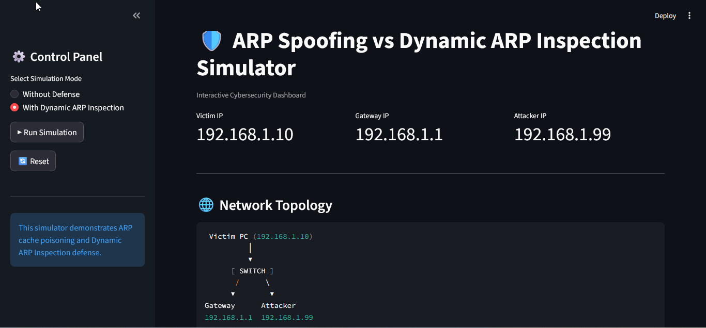
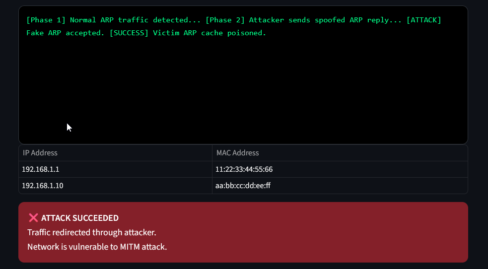
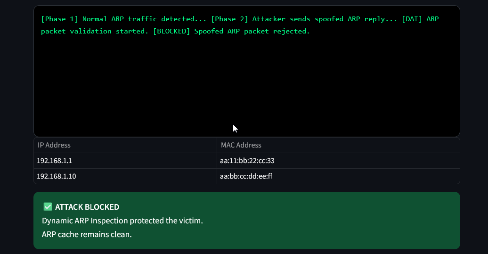

# 🛡️ ARP Spoofing Attack vs Dynamic ARP Inspection Defense Simulator

<p align="center">
  
  
  
  
</p>

<p align="center">
A professional cybersecurity simulation project demonstrating how <b>ARP Spoofing attacks</b> compromise networks and how <b>Dynamic ARP Inspection (DAI)</b> blocks malicious ARP packets.
</p>

---

## 📌 Overview

This project simulates an **ARP Spoofing (Man-in-the-Middle)** attack and demonstrates how **Dynamic ARP Inspection (DAI)** protects systems in a network environment.

The simulator helps visualize:

✅ How attackers poison ARP caches
✅ How traffic gets redirected through malicious hosts
✅ How DAI validates ARP packets
✅ How spoofed packets are blocked instantly
✅ How enterprise switches defend Layer-2 networks

This project is ideal for students, cybersecurity learners, and networking enthusiasts.

---

## 🌐 What is ARP Spoofing?

ARP Spoofing is a network attack where a malicious actor sends forged ARP replies to associate their MAC address with a legitimate IP address (commonly the gateway).

As a result:

* Victims trust the fake MAC address
* Network traffic gets redirected to the attacker
* Sensitive information can be intercepted
* Man-in-the-Middle (MITM) attacks become possible

---

## 🛡️ Defense: Dynamic ARP Inspection (DAI)

Dynamic ARP Inspection is a security feature used in managed switches.

DAI works by:

* Validating ARP packets against trusted IP-MAC bindings
* Using DHCP Snooping tables
* Detecting spoofed ARP replies
* Dropping packets with IP-MAC mismatches

This prevents ARP poisoning attacks in enterprise networks.

---

## 🖥️ Dashboard Preview

### 🔹 Main Interface



---

### 🔹 Attack Simulation (Without Defense)



---

### 🔹 Defense Simulation (With DAI)



---

## ⚡ Features

* 🎯 Simulates ARP Spoofing Attack
* 🛡️ Simulates Dynamic ARP Inspection Defense
* 🌐 Interactive Network Topology
* 📋 Live ARP Cache Visualization
* 📜 Real-Time Attack Logs
* 📊 Professional Streamlit Dashboard
* 🎓 Cybersecurity Learning Tool
* 🧪 Attack vs Defense Comparison

---

## 🗂️ Project Structure

```text id="p2nh76"
ARP-Spoofing-Attack-vs-Dynamic-ARP-Inspection-Defense/
├── app.py
├── README.md
├── requirements.txt
├── assets/
│   ├── ui.png
│   ├── attack.png
│   └── defense.png
├── attack/
│   └── arp_spoof.py
├── defense/
│   └── arp_inspection.py
├── simulator/
│   └── network_sim.py
```

### Modules

* `attack/arp_spoof.py` → Simulates ARP spoofing attack
* `defense/arp_inspection.py` → Simulates DAI packet inspection
* `simulator/network_sim.py` → Full network simulation logic
* `app.py` → Professional Streamlit dashboard UI

---

## 🚀 Installation

Clone the repository:

```bash id="6i7a9g"
git clone https://github.com/yourusername/ARP-Spoofing-Attack-vs-Dynamic-ARP-Inspection-Defense.git
cd ARP-Spoofing-Attack-vs-Dynamic-ARP-Inspection-Defense
```

Install dependencies:

```bash id="k1l5mr"
pip install -r requirements.txt
```

---

## ▶️ Run the Application

### Streamlit Dashboard (Recommended)

```bash id="t5v8sw"
streamlit run app.py
```

Open browser:

```text id="0cn4ik"
http://localhost:8501
```

### Terminal Simulation

```bash id="s4g3yl"
python simulator/network_sim.py
```

---

## 🔬 Demo Output

### Phase 1: Normal Traffic

* Legitimate ARP traffic accepted
* Gateway and victim bindings stored normally

### Phase 2: Without DAI

* Attacker sends fake ARP reply
* Victim ARP cache poisoned ❌
* Traffic redirected to attacker

### Phase 3: With DAI

* Spoofed ARP packet inspected
* IP-MAC mismatch detected
* Packet blocked instantly ✅

---

## ⚙️ Technologies Used

* Python 3
* Streamlit
* Pandas
* Scapy (packet crafting / simulation)
* Colorama (colored terminal output)

---

## 🎯 Use Cases

* Cybersecurity demonstrations
* Networking lab simulations
* MITM attack awareness
* Academic mini-projects
* Security training sessions
* ARP protocol education

---

## 👩‍💻 Author

**Suvetha Raj**
M.Sc Digital Forensics & Information Security

---

## ⚠️ Disclaimer

This project is created strictly for **educational purpose only** to understand ARP spoofing attacks and defensive security mechanisms like Dynamic ARP Inspection. It must not be used for unauthorized testing, attacks, or misuse on real networks.
